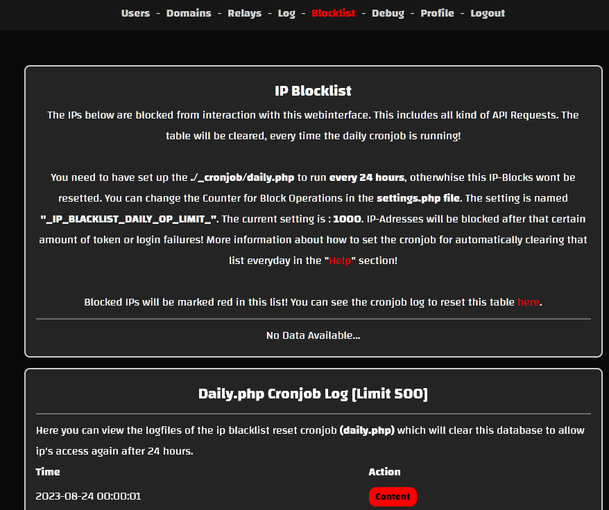

# Mail Relaying over DNS (MRoD)

Easily set up a secondary MX Backup Server for incoming mails on different domains!

-----------

## Introduction

This web software turns your server into a mail backup relay! It can be used standalone, allowing users to configure domains to relay to master mail servers. Additionally, this panel can be used on a secondary DNS server to fetch registered DNS domains. In summary, if you have a mail server that handles sending and receiving emails, this server remains untouched. However, if you plan to use a secondary server as a backup, it will store incoming mail until the primary server is back online, at which point the mail will be forwarded to the primary server. You can configure the master mail server per domain and set up different relay servers, which can then be connected to mail domains.

### Compatibility

This software has been tested on various Linux systems with Postfix in standalone mode and with Bind if auto-domain-fetching is required.

**Tested on:**
- Debian 8/9/10/11
- Ubuntu 16/18/20/22
- Different Postfix Versions (Standalone)
- Different Bind9 Versions (Auto-Fetch Domains)

### DNS Automation

If you have a secondary DNS server in your infrastructure, you can use this software on that server. By configuring `settings.php`, it will automatically fetch local domains from Bind9 files and save them into the database. The script will determine a relay server (configurable in `settings.php`) and update the Postfix configuration automatically. Domains will be auto-registered in the web interface, but you can still adjust settings if needed.

### Domain MX Records

To implement this software, configure a secondary "MX" DNS Record for the associated domain. This ensures incoming mail is routed to the server hosting this software if the primary server is unavailable. Add a second MX entry with a lower priority that specifies the mail hostname of your secondary mail backup server. This setup will queue mail on the secondary server if the primary server is down and relay it once the primary server is back online.

### User Management

The web interface includes a simple user management system with a permission framework, allowing easy administration of user accounts and access levels. This system ensures a secure and customizable experience within the web interface.

### Urgent Information

We strongly advise against deploying this software in a live mail environment. Modifying configurations on an active Plesk or other mail systems using this software may disrupt mail functionality. Use this software on a dedicated server or a secondary DNS server. Expertise in mail administration is recommended for effective system management.

-----------

## Screenshots  
Check out our [Screenshots Gallery](./screenshots.html) for a visual overview of the project. You’ll find images showcasing key features and user interface design, offering a preview of what to expect.

-----------

## Tutorials  
Visit the [Tutorials Page](./tutorials.html) for a collection of step-by-step guides that will help you get the most out of the project. These tutorials cover everything from installation to advanced functionality.

-----------

## Downloads  
The [Downloads Section](./download.html) provides all the necessary files to get started with the project, including the latest software versions and any related resources.

-----------

## Installation  
Follow the clear and detailed instructions in our [Installation Guide](./installation.html) to set up the project. This guide will help you get everything running smoothly on your system.

-----------

## Contributing  
Find out how you can contribute to the project by visiting the [Contributing Page](./contributing.html). Whether you want to report bugs, suggest features, or submit improvements, we welcome your involvement.

-----------

## Warranty  
Review the terms of our warranty on the [Warranty Information Page](./warranty.html). This page outlines the scope of support and any applicable guarantees.

-----------

## Support  
If you need assistance, visit the [Support Page](./support.html) to find the available channels for getting help with any issues or questions you might have.

-----------

## License  
Get the full details on licensing by checking out the [License Information Page](./license.html). This section includes the terms and conditions under which the project is distributed.