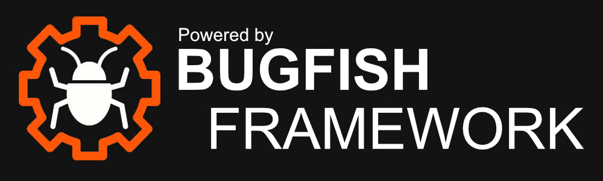
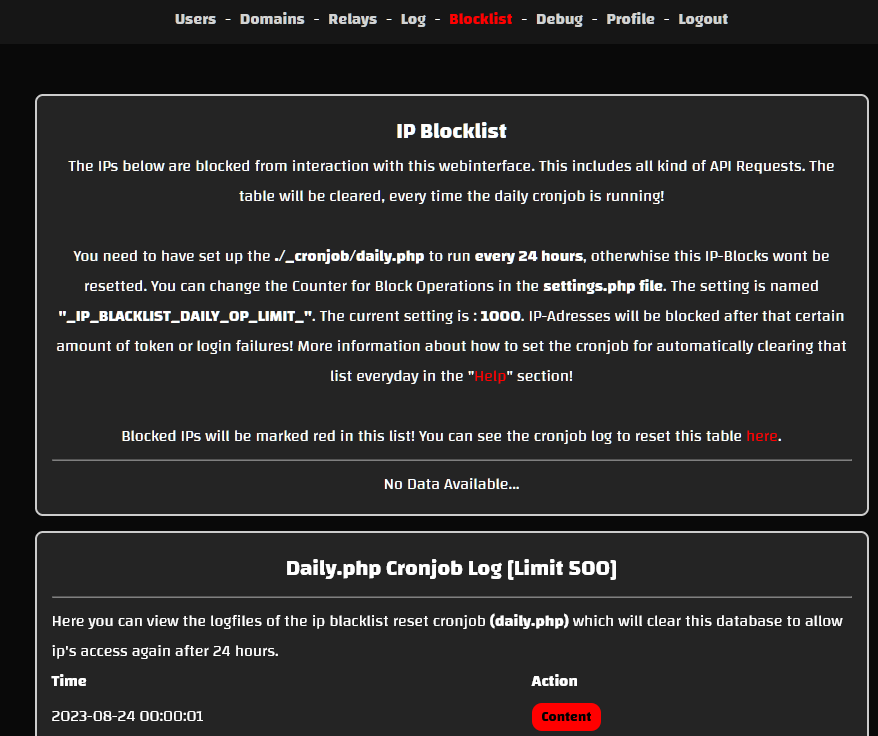
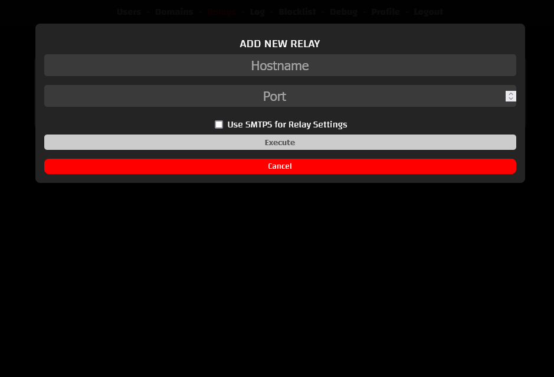
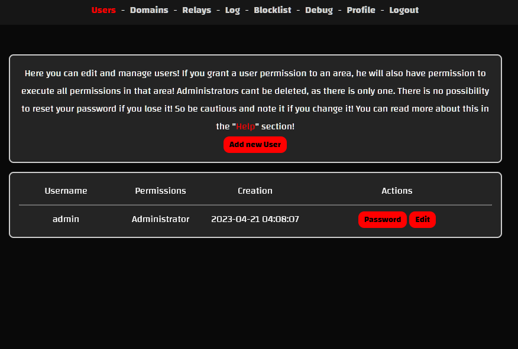

## Introduction

**Easily set up a secondary MX Backup Server for incoming mails on different domains!**

*The project's development has been facilitated through the utilization of the "Bugfish Framework."*

---

### General Information

This web software turns your server into a mail backup relay! It can be used standalone, allowing users to configure domains to relay to master mail servers. Additionally, this panel can be used on a secondary DNS server to fetch registered DNS domains. In summary, if you have a mail server that handles sending and receiving emails, this server remains untouched. However, if you plan to use a secondary server as a backup, it will store incoming mail until the primary server is back online, at which point the mail will be forwarded to the primary server. You can configure the master mail server per domain and set up different relay servers, which can then be connected to mail domains.

### Tutorial Videos
[Download Video](./Introduction.mp4) [Download Handout](./presentation.pptx)

<video width="320" height="240" style="padding: 10px; min-width: 100%; max-width: 200px;" controls>
            <source src="./Introduction.mp4" type="video/mp4">
            Your browser does not support the video tag.</video>

[Download Video](./information.mp4)

<video width="320" height="240" style="padding: 10px; min-width: 100%; max-width: 200px;" controls>
            <source src="./information.mp4" type="video/mp4">
            Your browser does not support the video tag.
        </video>

### Requirements

- Mail server running with Postfix
- Optional: Bind9 for fetching mail relaying information over DNS
- Web server with PHP 8 support
- MySQL Database

### Compatibility

This software has been tested on various Linux systems with Postfix in standalone mode and with Bind if auto-domain-fetching is required.

**Tested on:**
- Debian 8/9/10/11
- Ubuntu 16/18/20/22
- Different Postfix Versions (Standalone)
- Different Bind9 Versions (Auto-Fetch Domains)

### DNS Automation

If you have a secondary DNS server in your infrastructure, you can use this software on that server. By configuring `settings.php`, it will automatically fetch local domains from Bind9 files and save them into the database. The script will determine a relay server (configurable in `settings.php`) and update the Postfix configuration automatically. Domains will be auto-registered in the web interface, but you can still adjust settings if needed.

### Domain MX Records

To implement this software, configure a secondary "MX" DNS Record for the associated domain. This ensures incoming mail is routed to the server hosting this software if the primary server is unavailable. Add a second MX entry with a lower priority that specifies the mail hostname of your secondary mail backup server. This setup will queue mail on the secondary server if the primary server is down and relay it once the primary server is back online.

### User Management

The web interface includes a simple user management system with a permission framework, allowing easy administration of user accounts and access levels. This system ensures a secure and customizable experience within the web interface.

### Urgent Information

We strongly advise against deploying this software in a live mail environment. Modifying configurations on an active Plesk or other mail systems using this software may disrupt mail functionality. Use this software on a dedicated server or a secondary DNS server. Expertise in mail administration is recommended for effective system management.

### Software Screenshots

